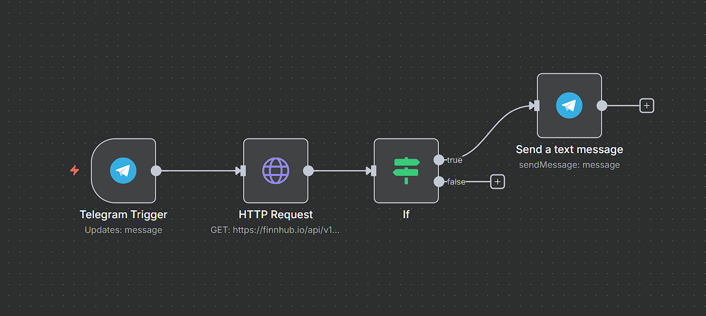

## 📌 Workflows

### Stock Alert
- **Description**: A Telegram bot that checks stock prices using the [Finnhub API](https://finnhub.io/) and alerts you when the price is above a threshold.
- **How it works**:
  1. Waits for a Telegram message (stock ticker symbol).
  2. Fetches the current stock price from Finnhub.
  3. Checks if the price is greater than `200`.
  4. Sends a Telegram alert with the price.
- **File**: [workflows/stock-alert.json](./workflows/stock-alert.json)
- **Screenshot**:  
  
- **Notes**:  
  - Replace `{{FINNHUB_API_KEY}}` with your own API key.  
  - Configure your own Telegram bot credentials in n8n after import.
